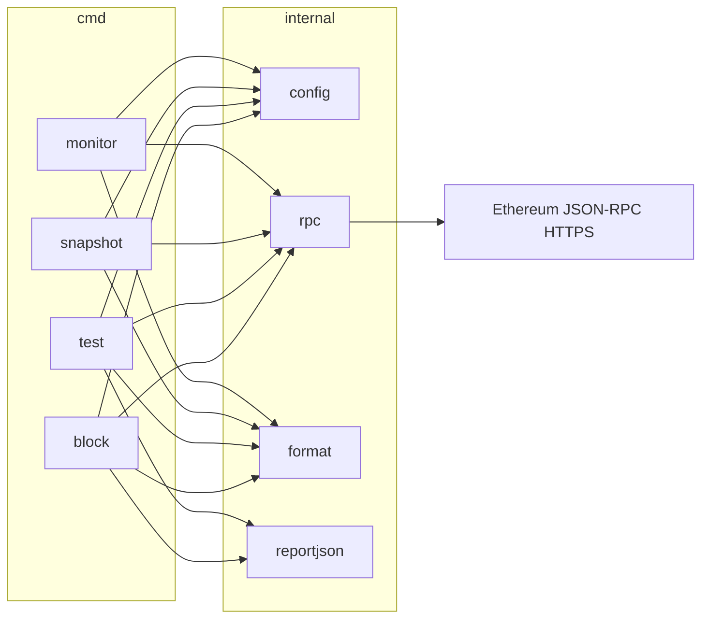

# Architecture (overview)

Four CLIs share YAML config and `internal/` libraries. Operational detail lives in [`AGENTS.md`](../AGENTS.md).

```mermaid
flowchart LR
  subgraph cmd [cmd]
    B[block]
    T[test]
    S[snapshot]
    M[monitor]
  end
  subgraph internal [internal]
    CFG[config]
    RPC[rpc]
    FMT[format]
    RJ[reportjson]
  end
  EP[Ethereum JSON-RPC HTTPS]
  B --> CFG
  T --> CFG
  S --> CFG
  M --> CFG
  B --> RPC
  T --> RPC
  S --> RPC
  M --> RPC
  B --> FMT
  T --> FMT
  S --> FMT
  M --> FMT
  B --> RJ
  T --> RJ
  RPC --> EP
```
