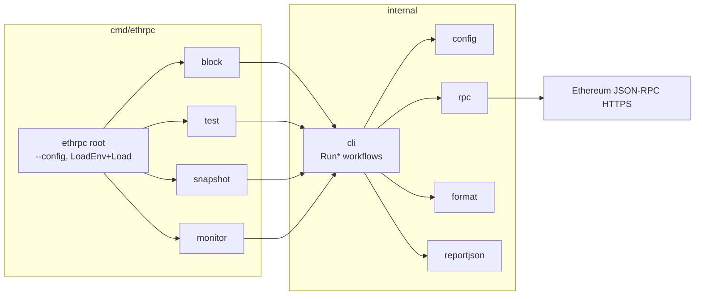

# Architecture (overview)

A single CLI (`cmd/ethrpc`, built on cobra) exposes four subcommands that share YAML config and the `internal/` libraries. Command workflows live in `internal/cli`; the cobra layer is a thin flag-wiring shell. Operational detail lives in [`AGENTS.md`](../AGENTS.md).

